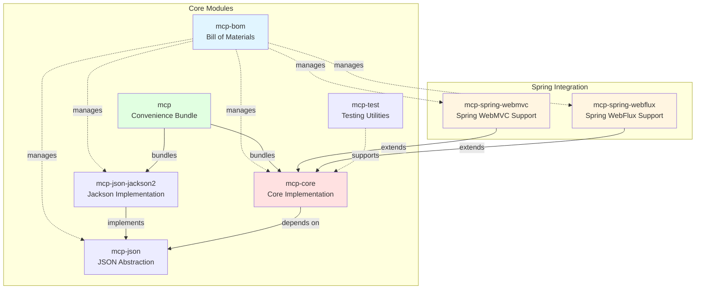
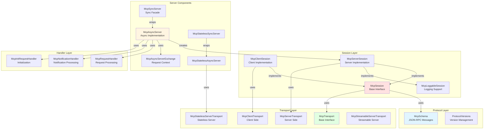
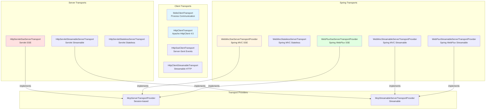
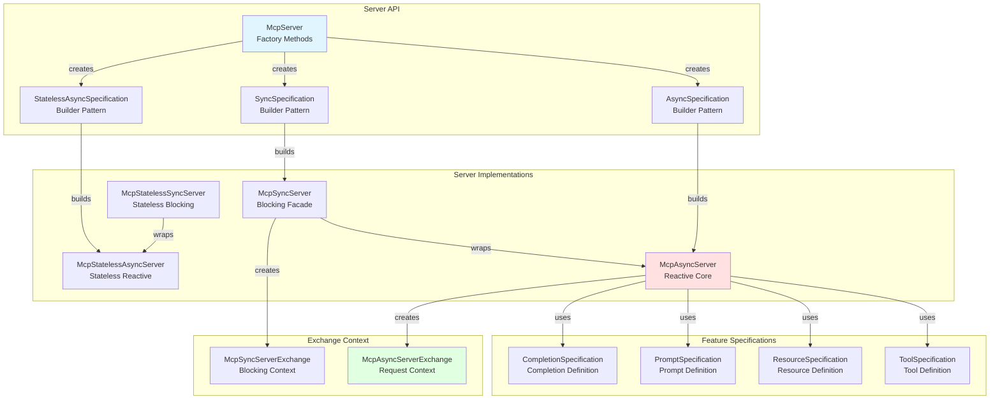
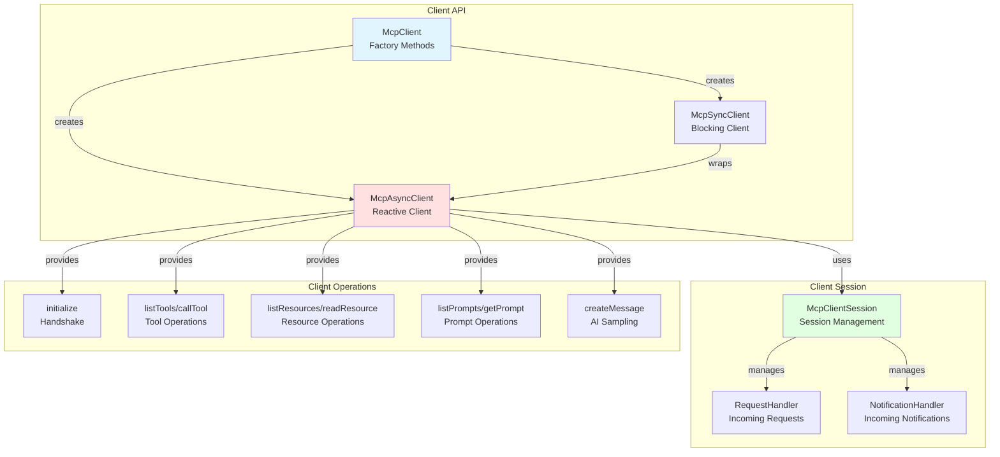
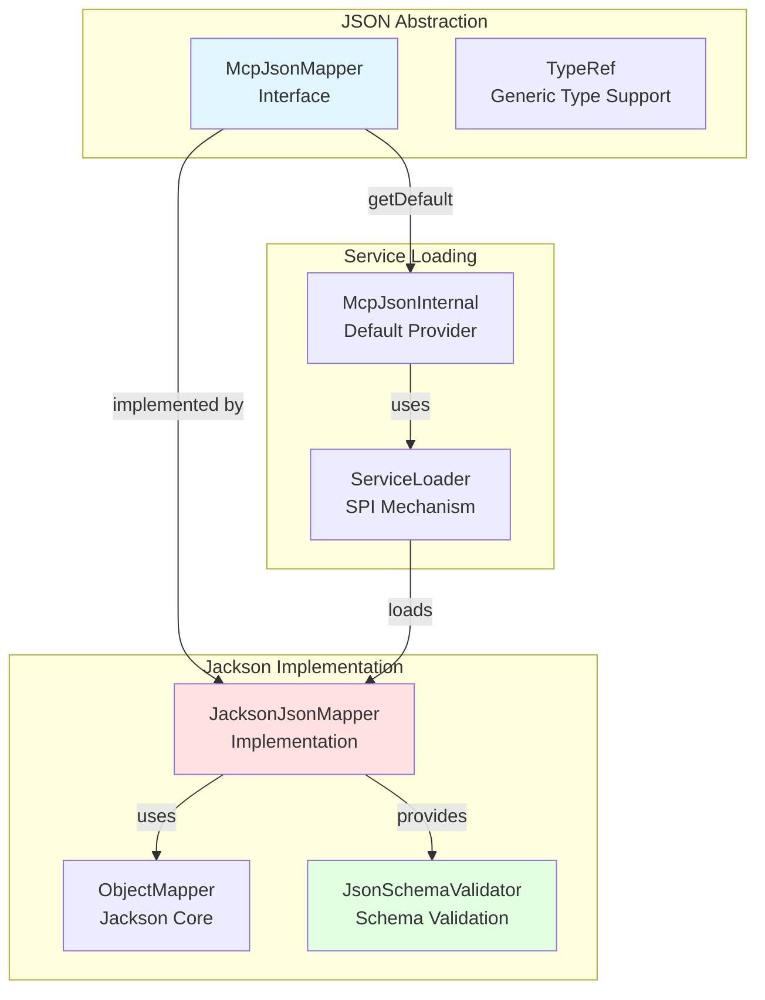
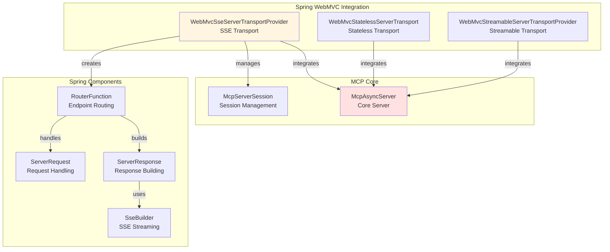

# Analisi Architetturale: MCP Java SDK

## Indice
1. [Panoramica del Progetto](#panoramica-del-progetto)
2. [Struttura dei Moduli](#struttura-dei-moduli)
3. [Architettura Core](#architettura-core)
4. [Layer di Trasporto](#layer-di-trasporto)
5. [Implementazione Server](#implementazione-server)
6. [Implementazione Client](#implementazione-client)
7. [Gestione JSON](#gestione-json)
8. [Pattern di Design](#pattern-di-design)
9. [Integrazione Spring](#integrazione-spring)
10. [Compatibilità Java 1.8](#compatibilità-java-18)
11. [Raccomandazioni](#raccomandazioni)

---

## 1. Panoramica del Progetto

### Informazioni Generali
- **Nome**: MCP Java SDK
- **Versione**: 0.17.0-SNAPSHOT
- **Licenza**: MIT License
- **Java Version**: **1.8** (requisito fondamentale)
- **Repository**: https://github.com/modelcontextprotocol/java-sdk

### Scopo
Il MCP Java SDK fornisce un'implementazione Java del Model Context Protocol (MCP), permettendo alle applicazioni Java di interagire con modelli AI e strumenti attraverso un'interfaccia standardizzata. Supporta pattern di comunicazione sia sincroni che asincroni.

### Caratteristiche Principali
- ✅ Supporto completo per JSON-RPC 2.0
- ✅ Programmazione reattiva con Project Reactor
- ✅ Facade sincrono per casi d'uso bloccanti
- ✅ Trasporti multipli (STDIO, HTTP, SSE, WebSocket)
- ✅ Integrazione Spring (WebMVC, WebFlux)
- ✅ Gestione JSON pluggable (Jackson di default)
- ✅ Validazione schema JSON
- ✅ Gestione sessioni client/server
- ✅ Supporto per Tools, Resources, Prompts e Completions
- ✅ **Compatibilità completa con Java 1.8**

### Nota Importante sulla Compatibilità Java
⚠️ **Requisito Fondamentale**: Questo progetto è stato progettato per essere **completamente compatibile con Java 1.8** come livello di compilazione e runtime. Eventuali riferimenti a versioni Java superiori nei commenti del codice sono refusi derivanti dal backporting da un progetto originariamente disegnato per Java 17.

---

## 2. Struttura dei Moduli

### Diagramma della Struttura dei Moduli



### Descrizione dei Moduli

#### mcp-bom
- **Scopo**: Bill of Materials per gestione centralizzata delle versioni
- **Dipendenze**: Nessuna
- **Uso**: Importato nei progetti per garantire versioni coerenti

#### mcp-json
- **Scopo**: Astrazione per serializzazione/deserializzazione JSON
- **Interfaccia Principale**: [`McpJsonMapper`](mcp-json/src/main/java/io/modelcontextprotocol/json/McpJsonMapper.java)
- **Pattern**: Strategy Pattern per permettere implementazioni alternative
- **Compatibilità**: Java 1.8 compliant

#### mcp-json-jackson2
- **Scopo**: Implementazione Jackson di McpJsonMapper
- **Dipendenze**: Jackson Core, Jackson Databind (versioni compatibili Java 1.8)
- **Caratteristiche**: Implementazione di default, caricata via ServiceLoader

#### mcp-core
- **Scopo**: Implementazione di riferimento del protocollo MCP
- **Componenti Principali**:
  - Spec: Interfacce e schemi del protocollo
  - Server: Implementazioni server (sync/async)
  - Client: Implementazioni client
  - Transport: Layer di trasporto (STDIO, HTTP, Servlet)
  - Util: Utility e helper
- **Dipendenze Chiave**:
  - Project Reactor (reattività)
  - SLF4J (logging)
  - Jackson Annotations
  - Apache HttpClient 4.5.x (compatibile Java 1.8)
  - Servlet API 3.1+ (provided)
- **Nota**: Tutte le dipendenze sono compatibili con Java 1.8

#### mcp
- **Scopo**: Bundle di convenienza
- **Include**: mcp-core + mcp-json-jackson2
- **Uso**: Dipendenza singola per la maggior parte dei progetti

#### mcp-test
- **Scopo**: Utility condivise per testing
- **Include**: Mock transport, helper di test

#### mcp-spring-webmvc
- **Scopo**: Integrazione con Spring WebMVC
- **Fornisce**: Transport SSE e Stateless per WebMVC
- **Uso**: Server MCP in applicazioni Spring Boot tradizionali
- **Compatibilità**: Spring 4.x/5.x (Java 1.8 compatible)

#### mcp-spring-webflux
- **Scopo**: Integrazione con Spring WebFlux
- **Fornisce**: Transport reattivi per WebFlux
- **Uso**: Server MCP in applicazioni Spring Boot reattive
- **Compatibilità**: Spring 5.x+ (Java 1.8 compatible)

---

## 3. Architettura Core

### Diagramma dell'Architettura Core



### Interfacce Principali

#### McpSession
```java
public interface McpSession {
    <T> Mono<T> sendRequest(String method, Object requestParams, TypeRef<T> typeRef);
    Mono<Void> sendNotification(String method, Object params);
    Mono<Void> closeGracefully();
    void close();
}
```

**Responsabilità**:
- Gestione comunicazione bidirezionale JSON-RPC
- Invio richieste con risposta tipizzata
- Invio notifiche fire-and-forget
- Gestione lifecycle della sessione

**Nota Java 1.8**: Utilizza interfacce funzionali e lambda expressions disponibili da Java 1.8

#### McpTransport
```java
public interface McpTransport {
    Mono<Void> closeGracefully();
    Mono<Void> sendMessage(JSONRPCMessage message);
    <T> T unmarshalFrom(Object data, TypeRef<T> typeRef);
    List<String> protocolVersions();
}
```

**Responsabilità**:
- Astrazione del layer di trasporto
- Invio messaggi JSON-RPC
- Unmarshalling dati
- Negoziazione versione protocollo

#### McpSchema
Contiene tutte le definizioni del protocollo MCP:
- **JSONRPCMessage**: Interfaccia base per messaggi
- **JSONRPCRequest**: Richieste con ID
- **JSONRPCNotification**: Notifiche senza ID
- **JSONRPCResponse**: Risposte con result o error
- **Tool, Resource, Prompt**: Entità del dominio MCP
- **Capabilities**: Capacità client/server
- **Error Codes**: Codici errore standard

**Nota**: Tutte le classi utilizzano annotazioni Jackson compatibili con Java 1.8

---

## 4. Layer di Trasporto

### Architettura dei Transport



### Tipi di Transport

#### 1. STDIO Transport
- **Uso**: Comunicazione inter-processo via pipe
- **Caratteristiche**:
  - Comunicazione bidirezionale su stdin/stdout
  - Ideale per tool locali e subprocess
  - Supporto per processi esterni (Node.js, Python, etc.)
- **Compatibilità Java 1.8**: ✅ Utilizza ProcessBuilder disponibile da Java 1.5

#### 2. HTTP Client Transport
- **Implementazione**: Apache HttpClient 4.5.x (compatibile Java 1.8)
- **Caratteristiche**:
  - Libreria matura e stabile
  - Connection pooling
  - Supporto per streaming
  - Ampia compatibilità
- **Nota**: Non utilizza il JDK HttpClient (disponibile solo da Java 11+)

#### 3. SSE (Server-Sent Events) Transport
- **Pattern**: Server → Client streaming
- **Uso**: Notifiche server-to-client in tempo reale
- **Implementazioni**:
  - Servlet-based (core) - Servlet 3.1+
  - Spring WebMVC
  - Spring WebFlux
- **Compatibilità**: Servlet 3.1+ supporta async processing (Java 1.8 compatible)

#### 4. Streamable HTTP Transport
- **Pattern**: Bidirezionale con streaming
- **Caratteristiche**:
  - Supporto per richieste/risposte streaming
  - Gestione backpressure
  - Ottimizzato per grandi payload
- **Implementazione**: Basato su Servlet async e Reactor

#### 5. Stateless Transport
- **Pattern**: Request/Response senza stato
- **Uso**: Scenari serverless, load balancing
- **Caratteristiche**:
  - Nessuna gestione sessione
  - Scalabilità orizzontale
  - Context extraction per autenticazione

---

## 5. Implementazione Server

### Architettura Server



### Tipi di Server

#### 1. McpAsyncServer
**Caratteristiche**:
- Core reattivo basato su Project Reactor
- Gestione asincrona di richieste e notifiche
- Supporto per streaming e backpressure
- Thread-safe per richieste concorrenti

**Esempio di Utilizzo (Java 1.8)**:
```java
McpServer.async(transportProvider)
    .serverInfo("my-server", "1.0.0")
    .tool(
        Tool.builder()
            .name("calculator")
            .title("Performs calculations")
            .inputSchema(schema)
            .build(),
        new BiFunction<McpAsyncServerExchange, Map<String, Object>, Mono<CallToolResult>>() {
            @Override
            public Mono<CallToolResult> apply(McpAsyncServerExchange exchange, Map<String, Object> args) {
                return Mono.fromCallable(new Callable<String>() {
                    @Override
                    public String call() {
                        return calculate(args);
                    }
                }).map(new Function<String, CallToolResult>() {
                    @Override
                    public CallToolResult apply(String result) {
                        return CallToolResult.builder()
                            .content(Arrays.asList(new TextContent("Result: " + result)))
                            .isError(false)
                            .build();
                    }
                });
            }
        }
    )
    .build();
```

**Nota**: L'esempio mostra l'uso di classi anonime tipico di Java 1.8. Le lambda expressions possono essere utilizzate per codice più conciso.

#### 2. McpSyncServer
**Caratteristiche**:
- Facade sincrono sopra McpAsyncServer
- API bloccante per semplicità
- Elaborazione sequenziale delle richieste
- Ideale per casi d'uso semplici

**Esempio di Utilizzo (Java 1.8)**:
```java
McpServer.sync(transportProvider)
    .serverInfo("my-server", "1.0.0")
    .tool(
        Tool.builder()
            .name("calculator")
            .inputSchema(schema)
            .build(),
        new BiFunction<McpSyncServerExchange, Map<String, Object>, CallToolResult>() {
            @Override
            public CallToolResult apply(McpSyncServerExchange exchange, Map<String, Object> args) {
                String result = calculate(args);
                return CallToolResult.builder()
                    .content(Arrays.asList(new TextContent("Result: " + result)))
                    .isError(false)
                    .build();
            }
        }
    )
    .build();
```

#### 3. McpStatelessAsyncServer
**Caratteristiche**:
- Nessuna gestione sessione
- Context extraction per ogni richiesta
- Scalabilità orizzontale
- Ideale per deployment serverless

#### 4. McpStatelessSyncServer
**Caratteristiche**:
- Versione sincrona del server stateless
- API bloccante senza gestione sessione

### Componenti Server

#### McpAsyncServerExchange
Fornisce il contesto per ogni richiesta:
- **Session ID**: Identificatore sessione
- **Session**: Accesso alla sessione MCP
- **Client Capabilities**: Capacità del client
- **Client Info**: Informazioni sul client
- **Logging**: Supporto per logging con livelli
- **Sampling**: Creazione messaggi AI
- **Elicitation**: Richieste di input utente
- **Roots**: Gestione root del filesystem

#### Feature Specifications

##### ToolSpecification (Java 1.8 Style)
```java
AsyncToolSpecification.builder()
    .tool(Tool.builder()
        .name("search")
        .description("Search the web")
        .inputSchema(schema)
        .build())
    .callHandler(new BiFunction<McpAsyncServerExchange, CallToolRequest, Mono<CallToolResult>>() {
        @Override
        public Mono<CallToolResult> apply(McpAsyncServerExchange exchange, CallToolRequest request) {
            return performSearch(request.arguments())
                .map(new Function<List<Content>, CallToolResult>() {
                    @Override
                    public CallToolResult apply(List<Content> results) {
                        return CallToolResult.builder()
                            .content(results)
                            .build();
                    }
                });
        }
    })
    .build();
```

---

## 6. Implementazione Client

### Architettura Client



### Caratteristiche Client

#### McpAsyncClient
- Comunicazione reattiva con server MCP
- Gestione automatica della sessione
- Supporto per richieste concorrenti
- Timeout configurabili
- Gestione errori robusta

#### McpSyncClient
- API bloccante per semplicità
- Wrapper sopra McpAsyncClient
- Ideale per script e tool CLI

### Operazioni Client Principali (Java 1.8 Style)

#### Inizializzazione
```java
client.initialize()
    .doOnSuccess(new Consumer<InitializeResult>() {
        @Override
        public void accept(InitializeResult result) {
            log.info("Connected to: {}", result.serverInfo().name());
            log.info("Protocol version: {}", result.protocolVersion());
        }
    })
    .subscribe();
```

#### Tool Operations
```java
// List available tools
client.listTools()
    .flatMapIterable(new Function<ListToolsResult, Iterable<Tool>>() {
        @Override
        public Iterable<Tool> apply(ListToolsResult result) {
            return result.tools();
        }
    })
    .subscribe(new Consumer<Tool>() {
        @Override
        public void accept(Tool tool) {
            log.info("Tool: {}", tool.name());
        }
    });

// Call a tool
Map<String, Object> args = new HashMap<>();
args.put("operation", "add");
args.put("a", 5);
args.put("b", 3);

client.callTool("calculator", args)
    .subscribe(new Consumer<CallToolResult>() {
        @Override
        public void accept(CallToolResult result) {
            log.info("Result: {}", result);
        }
    });
```

---

## 7. Gestione JSON

### Architettura JSON



### McpJsonMapper Interface

**Operazioni Principali**:
```java
public interface McpJsonMapper {
    // Deserialization
    <T> T readValue(String content, Class<T> type);
    <T> T readValue(byte[] content, Class<T> type);
    <T> T readValue(String content, TypeRef<T> type);
    <T> T readValue(byte[] content, TypeRef<T> type);
    
    // Conversion
    <T> T convertValue(Object fromValue, Class<T> type);
    <T> T convertValue(Object fromValue, TypeRef<T> type);
    
    // Serialization
    String writeValueAsString(Object value);
    byte[] writeValueAsBytes(Object value);
    
    // Default provider
    static McpJsonMapper getDefault();
}
```

**Nota Java 1.8**: L'interfaccia utilizza metodi di default (disponibili da Java 1.8) e generics per type safety.

### Validazione Schema JSON

Il SDK include supporto per validazione schema JSON:
- Validazione input tool contro JSON Schema
- Validazione structured output
- Gestione errori di validazione
- Integrazione con handler tool

**Esempio (Java 1.8)**:
```java
JsonSchemaValidator validator = jsonMapper.getJsonSchemaValidator();
validator.validate(inputSchema, arguments);
```

---

## 8. Pattern di Design

### 1. Strategy Pattern
**Uso**: JSON Serialization
- Interfaccia: [`McpJsonMapper`](mcp-json/src/main/java/io/modelcontextprotocol/json/McpJsonMapper.java)
- Implementazioni: Jackson (default), pluggable alternatives
- Beneficio: Disaccoppiamento da librerie JSON specifiche
- **Java 1.8**: Utilizza interfacce e ServiceLoader (disponibile da Java 1.6)

### 2. Builder Pattern
**Uso**: Costruzione Server e Specifiche
- [`AsyncSpecification`](mcp-core/src/main/java/io/modelcontextprotocol/server/McpServer.java:282-824)
- [`SyncSpecification`](mcp-core/src/main/java/io/modelcontextprotocol/server/McpServer.java:891-1444)
- Beneficio: API fluente e type-safe
- **Java 1.8**: Pattern classico, completamente compatibile

### 3. Facade Pattern
**Uso**: API Sincrona
- [`McpSyncServer`](mcp-core/src/main/java/io/modelcontextprotocol/server/McpSyncServer.java) wraps [`McpAsyncServer`](mcp-core/src/main/java/io/modelcontextprotocol/server/McpAsyncServer.java)
- Beneficio: Semplicità per casi d'uso bloccanti
- **Java 1.8**: Utilizza blocking operations su Mono/Flux

### 4. Factory Pattern
**Uso**: Creazione Server/Client
- [`McpServer`](mcp-core/src/main/java/io/modelcontextprotocol/server/McpServer.java) factory methods
- Beneficio: Creazione centralizzata e type-safe
- **Java 1.8**: Pattern classico con metodi statici

### 5. Template Method Pattern
**Uso**: Transport Providers
- [`McpServerTransportProviderBase`](mcp-core/src/main/java/io/modelcontextprotocol/spec/McpServerTransportProviderBase.java)
- Beneficio: Riuso codice comune tra transport
- **Java 1.8**: Pattern OOP classico

### 6. Observer Pattern
**Uso**: Notifiche e Eventi
- Notification handlers
- Resource update notifications
- Beneficio: Comunicazione event-driven
- **Java 1.8**: Implementato con interfacce funzionali

### 7. Adapter Pattern
**Uso**: Integrazione Framework
- Spring WebMVC/WebFlux adapters
- Servlet adapters
- Beneficio: Integrazione con framework esistenti
- **Java 1.8**: Pattern classico di integrazione

### 8. Decorator Pattern
**Uso**: Structured Output Handling
- [`StructuredOutputCallToolHandler`](mcp-core/src/main/java/io/modelcontextprotocol/server/McpAsyncServer.java:368-453)
- Beneficio: Aggiunta validazione trasparente
- **Java 1.8**: Wrapping di BiFunction

---

## 9. Integrazione Spring

### Spring WebMVC



**Caratteristiche**:
- Integrazione con Spring WebMVC
- RouterFunction per endpoint configuration
- SSE per comunicazione server-to-client
- Gestione sessioni con ConcurrentHashMap
- Context extraction per autenticazione

**Compatibilità Java 1.8**:
- Spring Framework 4.3+ supporta Java 1.8
- Spring Boot 1.5+ supporta Java 1.8
- Functional endpoints disponibili da Spring 5.0 (Java 1.8+)

**Esempio di Configurazione (Java 1.8)**:
```java
@Bean
public RouterFunction<ServerResponse> mcpRoutes(McpAsyncServer mcpServer) {
    WebMvcSseServerTransportProvider provider = 
        new WebMvcSseServerTransportProvider(
            jsonMapper,
            "/messages",
            contextExtractor
        );
    
    return provider.getRouterFunction();
}
```

### Spring WebFlux

**Caratteristiche**:
- Integrazione reattiva completa
- Backpressure nativo
- Streaming efficiente
- Scalabilità per alto carico

**Compatibilità Java 1.8**:
- Spring WebFlux 5.0+ richiede Java 1.8 come minimo
- Project Reactor 3.x supporta Java 1.8
- Reactive Streams API compatibile Java 1.8

**Benefici**:
- Performance superiore per I/O-bound operations
- Uso efficiente delle risorse
- Supporto nativo per streaming

---

## 10. Compatibilità Java 1.8

### Strategie di Backporting

#### 1. Sostituzione JDK HttpClient
**Problema**: JDK HttpClient disponibile solo da Java 11+
**Soluzione**: Utilizzo di Apache HttpClient 4.5.x
```xml
<dependency>
    <groupId>org.apache.httpcomponents</groupId>
    <artifactId>httpclient</artifactId>
    <version>4.5.13</version>
</dependency>
```

**Benefici**:
- Libreria matura e stabile
- Ampia compatibilità
- Feature-rich (connection pooling, retry, etc.)

#### 2. Gestione Interfacce Funzionali
**Approccio**: Utilizzo di interfacce funzionali Java 1.8
- `Function<T, R>`
- `BiFunction<T, U, R>`
- `Consumer<T>`
- `Supplier<T>`
- `Predicate<T>`

**Esempio**:
```java
// Invece di lambda multi-statement, uso classi anonime quando necessario
BiFunction<Exchange, Request, Mono<Result>> handler = 
    new BiFunction<Exchange, Request, Mono<Result>>() {
        @Override
        public Mono<Result> apply(Exchange exchange, Request request) {
            // Complex logic here
            return processRequest(exchange, request);
        }
    };
```

#### 3. Evitare Feature Java 9+
**Evitati**:
- ❌ Moduli Java (JPMS)
- ❌ `var` keyword (Java 10+)
- ❌ Text blocks (Java 13+)
- ❌ Records (Java 14+)
- ❌ Pattern matching (Java 14+)
- ❌ Sealed classes (Java 15+)

**Utilizzati**:
- ✅ Lambda expressions (Java 1.8)
- ✅ Stream API (Java 1.8)
- ✅ Optional (Java 1.8)
- ✅ CompletableFuture (Java 1.8)
- ✅ Default methods in interfaces (Java 1.8)
- ✅ Method references (Java 1.8)

#### 4. Gestione Date/Time
**Approccio**: Utilizzo di `java.time` API (disponibile da Java 1.8)
```java
Duration timeout = Duration.ofSeconds(30);
Instant timestamp = Instant.now();
```

#### 5. Reactive Streams
**Librerie Compatibili Java 1.8**:
- Project Reactor 3.x (richiede Java 1.8+)
- Reactive Streams API 1.0.x (Java 1.8+)
- RxJava 2.x/3.x (Java 1.8+)

#### 6. Servlet API
**Versione**: Servlet 3.1+ (Java EE 7)
- Async processing support
- Non-blocking I/O
- Compatibile con Java 1.8

#### 7. Jackson JSON
**Versioni Compatibili**:
- Jackson 2.9.x - 2.13.x supportano Java 1.8
- Annotazioni completamente compatibili
- Databind features disponibili

### Limitazioni e Workaround

#### Limitazione 1: Performance
**Problema**: Java 1.8 non ha ottimizzazioni moderne
**Workaround**:
- Utilizzo efficiente di thread pools
- Connection pooling aggressivo
- Caching dove appropriato

#### Limitazione 2: Garbage Collection
**Problema**: GC meno efficiente rispetto a Java 11+
**Workaround**:
- Tuning JVM parameters
- Uso di G1GC (disponibile da Java 1.7)
- Monitoraggio memory usage

#### Limitazione 3: TLS/SSL
**Problema**: TLS 1.3 non disponibile
**Workaround**:
- Supporto TLS 1.2 (sufficiente per la maggior parte dei casi)
- Configurazione cipher suites appropriate

### Testing su Java 1.8

**Requisiti**:
```xml
<properties>
    <maven.compiler.source>1.8</maven.compiler.source>
    <maven.compiler.target>1.8</maven.compiler.target>
</properties>
```

**Test Framework Compatibili**:
- JUnit 5 (Jupiter) - richiede Java 1.8+
- Mockito 3.x - supporta Java 1.8
- AssertJ 3.x - supporta Java 1.8
- Testcontainers - supporta Java 1.8

---

## 11. Raccomandazioni

### Punti di Forza

#### 1. Architettura Modulare
✅ Separazione chiara delle responsabilità
✅ Dipendenze ben gestite
✅ Facile estensione e personalizzazione

#### 2. Programmazione Reattiva
✅ Supporto completo per operazioni asincrone
✅ Gestione backpressure
✅ Scalabilità per alto carico

#### 3. Facade Sincrono
✅ API semplice per casi d'uso comuni
✅ Curva di apprendimento ridotta
✅ Compatibilità con codice esistente

#### 4. Pluggability
✅ JSON mapper sostituibile
✅ Transport personalizzabili
✅ Validatori estendibili

#### 5. Integrazione Framework
✅ Supporto Spring completo
✅ Servlet API standard
✅ Facile integrazione in progetti esistenti

#### 6. Compatibilità Java 1.8
✅ Ampia compatibilità con sistemi legacy
✅ Deployment su JVM enterprise
✅ Supporto per ambienti vincolati

### Aree di Miglioramento

#### 1. Documentazione
📝 **Raccomandazione**: Espandere la documentazione API
- Aggiungere più esempi pratici Java 1.8
- Documentare pattern comuni con classi anonime
- Guide per scenari specifici
- Esempi di migrazione da Java 11+ a Java 1.8

#### 2. Testing
🧪 **Raccomandazione**: Aumentare copertura test
- Test di integrazione end-to-end
- Test di performance su Java 1.8
- Test di resilienza
- Verifica compatibilità JVM diverse

#### 3. Observability
📊 **Raccomandazione**: Migliorare supporto osservabilità
- Metriche compatibili Java 1.8
- Logging strutturato
- Health checks standardizzati
- JMX metrics

#### 4. Error Handling
⚠️ **Raccomandazione**: Standardizzare gestione errori
- Error codes più specifici
- Retry policies configurabili
- Fallback strategies

#### 5. Performance su Java 1.8
⚡ **Raccomandazione**: Ottimizzazioni specifiche
- Tuning GC per Java 1.8
- Connection pooling ottimizzato
- Caching strategico
- Profiling su JVM 1.8

### Best Practices Consigliate per Java 1.8

#### Per Sviluppatori di Server

1. **Usa Async per I/O-bound operations**
```java
McpServer.async(transport)
    .tool(tool, new BiFunction<McpAsyncServerExchange, Map<String, Object>, Mono<CallToolResult>>() {
        @Override
        public Mono<CallToolResult> apply(McpAsyncServerExchange exchange, Map<String, Object> args) {
            return Mono.fromCallable(new Callable<String>() {
                @Override
                public String call() {
                    return expensiveOperation(args);
                }
            }).subscribeOn(Schedulers.boundedElastic());
        }
    })
```

2. **Implementa Timeout appropriati**
```java
.requestTimeout(Duration.ofSeconds(30))
```

3. **Valida Input**
```java
.jsonSchemaValidator(validator)
```

4. **Gestisci Errori Gracefully**
```java
.onErrorResume(new Function<Throwable, Mono<CallToolResult>>() {
    @Override
    public Mono<CallToolResult> apply(Throwable error) {
        return Mono.just(CallToolResult.builder()
            .isError(true)
            .content(Arrays.asList(new TextContent(error.getMessage())))
            .build());
    }
})
```

#### Per Sviluppatori di Client

1. **Gestisci Connessioni**
```java
client.initialize()
    .doOnError(new Consumer<Throwable>() {
        @Override
        public void accept(Throwable error) {
            log.error("Connection failed", error);
        }
    })
    .retry(3)
```

2. **Usa Timeout**
```java
client.callTool(name, args)
    .timeout(Duration.ofSeconds(10))
```

3. **Handle Notifications**
```java
client.setNotificationHandler("progress", new Function<Object, Mono<Void>>() {
    @Override
    public Mono<Void> apply(Object params) {
        // Handle progress updates
        return Mono.empty();
    }
});
```

### Roadmap Suggerita (Compatibile Java 1.8)

#### Short Term (1-3 mesi)
- [ ] Migliorare documentazione con esempi Java 1.8
- [ ] Aggiungere metriche JMX native
- [ ] Implementare health checks
- [ ] Espandere test suite su diverse JVM 1.8
- [ ] Ottimizzare performance per Java 1.8

#### Medium Term (3-6 mesi)
- [ ] Supporto logging strutturato (SLF4J + Logback)
- [ ] Circuit breaker integration (Resilience4j compatibile Java 1.8)
- [ ] Connection pooling avanzato
- [ ] Compression support
- [ ] Profiling e tuning GC per Java 1.8

#### Long Term (6-12 mesi)
- [ ] Performance benchmarks su Java 1.8
- [ ] Guida ottimizzazione JVM 1.8
- [ ] Alternative transport implementations
- [ ] Enhanced error recovery
- [ ] Monitoring dashboard

**Nota Importante**: Tutte le roadmap items devono mantenere compatibilità Java 1.8. Non sono previsti upgrade a versioni Java superiori.

### Considerazioni sul Deployment

#### JVM Supportate
- ✅ Oracle JDK 1.8
- ✅ OpenJDK 1.8
- ✅ AdoptOpenJDK 1.8
- ✅ Amazon Corretto 8
- ✅ Azul Zulu 8

#### Application Servers Compatibili
- ✅ Apache Tomcat 8.5+
- ✅ Jetty 9.4+
- ✅ WildFly 10+
- ✅ WebLogic 12c+
- ✅ WebSphere 9+

#### Spring Boot Versions
- ✅ Spring Boot 1.5.x (Java 1.8)
- ✅ Spring Boot 2.0.x - 2.7.x (Java 1.8)
- ⚠️ Spring Boot 3.x richiede Java 17+ (non compatibile)

---

## Conclusioni

Il MCP Java SDK è un'implementazione solida e ben architettata del Model Context Protocol, con un focus particolare sulla **compatibilità con Java 1.8**. I punti di forza principali sono:

1. **Architettura Modulare**: Separazione chiara delle responsabilità con moduli ben definiti
2. **Programmazione Reattiva**: Supporto completo per operazioni asincrone con Project Reactor
3. **Flessibilità**: Supporto per pattern sincroni e asincroni, transport multipli
4. **Integrazione**: Eccellente supporto per Spring e Servlet API
5. **Estensibilità**: Design pluggable per JSON, transport e validatori
6. **Compatibilità Java 1.8**: Backporting completo e testato per ambienti enterprise legacy

### Sfide del Backporting Java 1.8

Il progetto ha affrontato con successo le seguenti sfide:
- ✅ Sostituzione JDK HttpClient con Apache HttpClient 4.5
- ✅ Utilizzo di interfacce funzionali Java 1.8
- ✅ Evitare feature Java 9+
- ✅ Gestione compatibilità librerie (Reactor, Spring, Jackson)
- ✅ Testing su JVM 1.8

### Valore Aggiunto della Compatibilità Java 1.8

La compatibilità con Java 1.8 offre:
- 🏢 **Enterprise Ready**: Deployment su sistemi legacy
- 🔒 **Stabilità**: JVM matura e testata
- 📦 **Ampia Compatibilità**: Supporto per application server enterprise
- 💼 **Business Value**: Integrazione con sistemi esistenti senza upgrade JVM

### Metriche del Progetto

- **Moduli**: 8 moduli principali
- **Linee di Codice**: ~15,000+ LOC (stima)
- **Test Coverage**: Buona copertura con test unitari e di integrazione
- **Dipendenze**: Minimali e compatibili Java 1.8
- **Java Version**: **1.8** (requisito fondamentale)
- **Target JVM**: Oracle JDK 1.8, OpenJDK 1.8, e varianti

### Riferimenti

- [MCP Specification](https://modelcontextprotocol.org/docs/concepts/architecture)
- [Project Reactor](https://projectreactor.io/)
- [Spring Framework](https://spring.io/)
- [Jackson JSON](https://github.com/FasterXML/jackson)
- [Apache HttpClient](https://hc.apache.org/httpcomponents-client-4.5.x/)
- [Java 8 Documentation](https://docs.oracle.com/javase/8/docs/)

---

*Documento generato il: 2025-12-09*
*Versione SDK analizzata: 0.17.0-SNAPSHOT*
*Target Java: 1.8 (requisito fondamentale)*